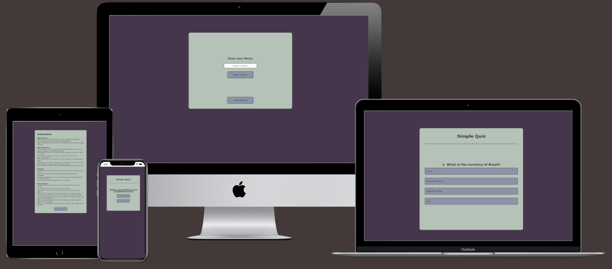
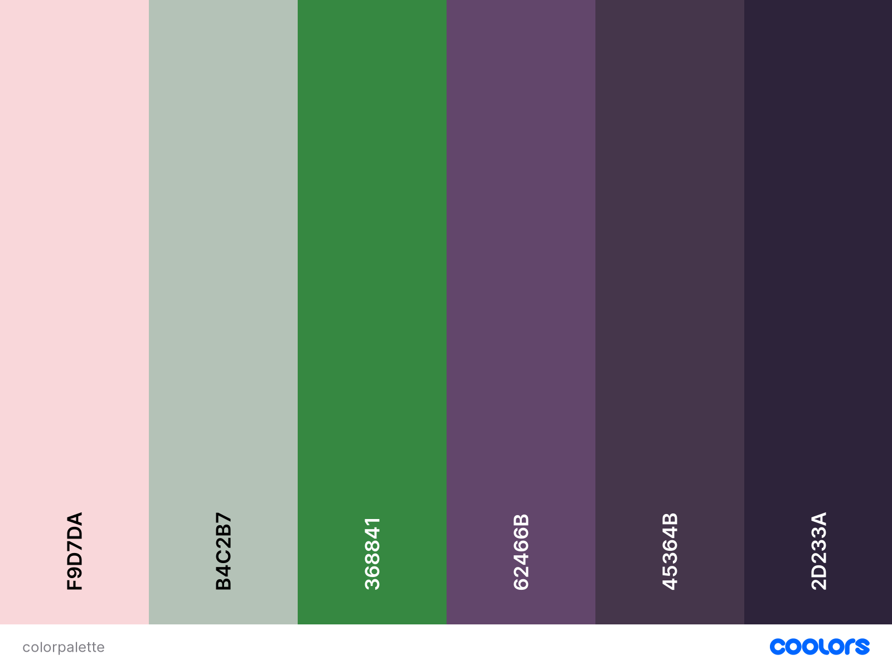

# Code Institute Project 2 HTML, CSS, and JavaScript

 # My JavaScript Quiz

 
 
 [View Quiz on Github Pages](https://mrhaju.github.io/Code-Institute-Projekt-2-CSS-HTML-JavaScript/)

 This Website was created to play a fun Quiz in your Browser

 ## Contents

* [User Experience (UX)](#User-Experience-(UX))
    * [Initial Discussion](#Initial-Discussion)
    * [User Stories](#User-Stories)

* [Design](#Design)
  * [Colour Scheme](#Colour-Scheme)
  * [Typography](#Typography)
  * [Imagery](#Imagery)
  * [Wireframes](#Wireframes)
  * [Features](#Features)
  * [Accessibility](#Accessibility)
  * [Technologies Used](#Technologies-Used)
  * [Languages Used](#Languages-Used)
  * [Frameworks, Libraries & Programs Used](#Frameworks,-Libraries-&-Programs-Used)

* [Deployment & Local Development](#Deployment-&-Local-Development)
  * [Deployment](#Deployment)
  * [Local Development](#Local-Development)
    * [How to Fork](#How-to-Fork)
    * [How to Clone](#How-to-Clone)

* [Testing](#Testing)
    
* [Credits](#Credits)
  * [Code Used](#Code-Used)
  * [Content](#Content)
  * [Media](#Media)
  * [Acknowledgments](#Acknowledgments)

## User Experience (UX)

### Initial Discussion

I build this simple quiz app as a Java Script essential portfolio project.

#### Key information for the site

* Enter a Player Name.
* Play 1 or more rounds in the Quiz.
* View your Score at the End of each row.
* A Instruction Page.

### User Stories

#### Client Goals

* Have fun, playing a Quiz game.

#### First-Time Visitor Goals

* I want to find out what I can do with this app.
* I want to be able to navigate the site easily.
* I want to read the Instructions.
* I want to enter my Player Name.
* I want to play the Quiz game.
* I want to view my Score.
* I want to decide if I play another round or end the Game after I viewed my Score.

#### Returning Visitor Goals

* I want to enter my Player Name.
* I want to play the Quiz game.
* I want to view my Score.
* I want to decide if I play another round or end the Game after I viewed my Score.

- - -

## Design

### Colour Scheme

The Website uses a palette of warm pastel colors. The color palette was displayed using the [Coolors](https://coolors.co/) website.

### Typography

As fonts were used:

* Verdana
* Geneva
* Tahoma

### Imagery

All images used are created by myself.

### Features

The website is comprised of three pages. (home page, quiz page, and Instruction page).

* All Pages on the website are fully responsible for the best User Experience on all Devices.

* Home Page.

  * A Input Field to insert a Player Name.
  * A Start Button.
  * A Button to visit the Instruction Page.

* Quiz Page

  * 10 random Questions with 4 Answers.
  * One of the 4 Answers is correct. 
  * A Next Button appears after you have chosen an Answer.
  * A Scoreboard with Player Name and Score out of 10 questions.

  * A End Game button to skip back to the Homepage.
  * A Play Again button to restart the Quiz.
  

* Instruction Page. 

  * A description of how to use the Quiz game.
  * A Back Button to head back to the Homepage.

* Future Implementations.
  * Levels (easy, medium, hard)
  * A board that shows how many Questions are left, how many right, and how many wrong answers you gave.
  
### Accessibility

When writing the code, I tried to make the website as user-friendly and clear as possible. I have achieved this by:

* Using semantic HTML.
* Ensuring that there is a sufficient color contrast throughout the site.

- - -

## Technologies Used

### Languages Used

HTML, CSS, and Java Script were used to create this website.

### Frameworks, Libraries & Programs Used

Git - For version control.

Github - To save and store the files for the website.

Google Dev Tools - To troubleshoot and test features, and solve issues with responsiveness and styling.

- - -

## Deployment & Local Development

### Deployment

GitHub Pages were used to deploy the live website. The instructions to achieve this are below:

1. Login (or sign up) to Github.
2. Find the repository for this project, Code-Institute-Projekt-2-CSS-HTML-JavaScript.
3. Click on the Settings link.
4. Click on the Pages link in the left-hand side navigation bar.
5. In the Source section, choose main from the drop-down select branch menu. Select Root from the drop-down select folder menu.
6. Click Save. Your live Github Pages site is now deployed at the URL shown.

### Local Development

#### How to Clone

To clone the Code-Institute-Projekt-2-CSS-HTML-JavaScript repository:

1. Login (or sign up) to GitHub.
2. Go to the repository for this project, MrHaJu/Code-Institute-Projekt-2-CSS-HTML-JavaScript.
3. Click on the code button, select whether you would like to clone with HTTPS, SSH, or GitHub CLI, and copy the link shown.
4. Open the terminal in your code editor and change the current working directory to the location you want to use for the cloned directory.
5. Type 'git clone' into the terminal and then paste the link you copied in step 3. Press enter.

- - -

## **Testing**

Please view the [testing.md](testing.md) file for more information on the testing undertaken.

- - -

## Credits

### Code Used

* [Code from Bito VSC extension to find Bugs and Explain how code works](https://marketplace.visualstudio.com/items?itemName=Bito.Bito)
* [Tutorial By GreatStack used as a Base for the Quiz](https://youtu.be/PBcqGxrr9g8)
* [ChatGpt](Https://openai.com)

### Content

The content of the website was written by the owner (Andreas Huppertz)

### Acknowledgments

* [Jubril Akolade](https://github.com/Jubrillionaire), my Code Institute Mentor.
* [GreatStack YouTube Channel](https://www.youtube.com/@GreatStackDev)
* [ChatGpt](Https://openai.com)