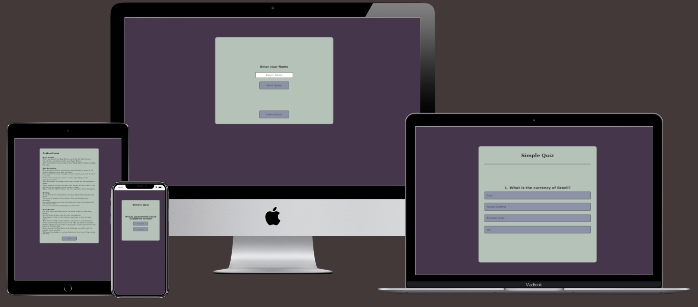

# Code Institute Projekt 1 HTML and CSS - TESTING
 
 ## My Portfolio Website

 
 
 [View Quiz on Github Pages](https://mrhaju.github.io/Code-Institute-Projekt-2-CSS-HTML-JavaScript/)

## Contents

* [AUTOMATED TESTING](#automated-testing)
    * [W3C Validator](#w3c-validator)
    * [Lighthouse](#lighthouse)
    * [Wave](#wave)
    * [jshint](#javascript-validator)

* [MANUAL TESTING](#manual-testing)
    * [Full Testing](#full-testing)
    * [User Stories](#user-stories)
    * [Browser Testing](#browser-testing)

* [BUGS](#bugs)
    * [Known Bugs](#known-bugs)
    * [Solved Bugs](#solved-bugs)

---

## AUTOMATED TESTING

Testing was ongoing throughout the entire build. I utilised Chrome developer tools while building to pinpoint and troubleshoot any issues as I went along.

### W3C Validator

* [Index Page HTML](assets/images/testing/w3c/w3cindex.png)
* [Quiz Page HTML](assets/images/testing/w3c/w3cquiz.png)
* [Instructions Page HTML](assets/images/testing/w3c/w3cinstructions.png)

#### **CSS Validation**

* [style.css CSS](assets/images/testing/w3c/w3cstylecss.png)

---

### JavaScript Validator

[jshint](https://jshint.com/) was used to validate the JavaScript.

* [scripts.js](documentation/testing/validation/jshint-contact.png)
* [index.js](assets/images/testing/jshint/jshint-projects.png)
* [questions.json](assets/images/testing/jshint/jshint-projects.png)

### Json Validator

[jsonlint.com](https://jsonlint.com/) was used to validate the Json Data.

*[questions.json](./images/testing/jsonlint/jsonlintquestions.png)

- - -

### Lighthouse

I used Lighthouse within the Chrome Developer Tools to allow me to test the performance, accessibility, best practices and SEO of the website.

lighthouse testing :
* #### Desktop:

    * [Index Page - Test ](./images/testing/lighthouse/lightjouseindex-desktop.png)
    * [Instruction Page - Test ](./images/testing/lighthouse/lightjouseinstructions-desktop.png)
    * [Quiz Page - Test ](./images/testing/lighthouse/lightjousequiz-desktop.png)
    

* #### Mobile:

    * [Index Page - Test ](./images/testing/lighthouse/lightjouseindex-mobile.png)
    * [Instruction Page - Test ](./images/testing/lighthouse/lightjouseinstructions-mobile.png)
    * [Quiz Page - Test ](./images/testing/lighthouse/lightjousequiz-mobile.png)

### WAVE

* [Wave Test](./images/testing/wave/wavetest.png)

- - -

## MANUAL TESTING

### Solved Bugs

| Bug No | Bug Issue | How Resolved |
| :--- | :--- | :--- |
| 1 | On mobile devices, the app was a little off center to the right. | with justify content, this problem was solved |
| 2 | getting the Player Name from index Page to the Score Page called an issue so the questions couldn´t load | putting the Player Name in local storage and call it with get playername solved the problem |
| 3 | instead of retrieving the questions in the Scripts.js, saving the questions in the questions.json resulted in the questions no longer being displayed | solved with an asynchronous function and await fetch |
| 4 | the same questions were always loaded | solved with a function (.sort, .slice) |

### Known Bugs

| Known Bug No | Bug Issue | Plan to Resolve |
| :--- | :--- | :--- |
| 1 |  |  |

- - -

### Full Testing

Full testing was performed on the following devices, and additional testing for other devices was carried out using developer tools:

Desktop PC Windows 11, Samsung S20 Ultra, 46 inch monitor, 43 inch Ultra Wide 4k monitor, 27 inch monitor, windows 10 17 inch laptop, Asus Zen Phone, I Mac.

Each device tested the site using the following browsers:

Google Chrome and Microsoft edge on Windows and Android. Safari on Mac

| Feature | Expected Outcome | Testing Performed | Result | Pass/Fail |
| --- | --- | --- | --- | --- |
| `Index Page` |  |  |  |  |
| Button Hover  | When hover over Button it will change colour | Hovered over Button | colour changed | Pass |
| Input Text | Game only starts if Player Name is chosen | insert Playername and click start Game| Game started | Pass |
| Start without Playername  | Game only starts if Player Name is chosen | click Star Game without choosing Playername | Game will not start | Pass |
| Instructions | when click on Instructions, Instruction Page loades | clicked on Instructions | Instruction Page opens | Pass |
|  |  |  |  |  |
| `Quiz Page` |  |  |  |  |
| Button Hover  | When hover over Buttons it will change colour | Hovered over Button | colour changed | Pass |
| click right Answer | When click right answer button colour changes to Green.  | click right answer | Button changes to green | Pass |
| click wrong Answer | When click wrong answer button colour changes to light red.  | click wrong answer | Button changes to light red | Pass |
| Next Button click | When click on Next Button, the next Question appears | clicked on Next Button | next Question appears | Pass |
| Next Button | Next Button only appears if any Answer is chosen | choose Answer | Next Button appears | Pass |
| No click | if any Answer is chosen, you are not allowed to click anything but Next Button | choose Answer | Only Next Button is clickable | Pass |
|  |  |  |  |  |
| `Instruction Page` |  |  |  |  |
| Back Button | When click on Back Button, it returns to Index Page | Click Back Button | head back to Index Page  | Pass |
|  |  |  |  |  |
| `Score Board` |  |  |  |  |
| Score | after finsishing 10 Questions, Score Boar is loaded, shows Score and beneath Score, Play Again Button and End Game Button is shown | finish 10 Questions | Score, Play Again Button and End Game Button is shown | Pass |
| Click Play Again Button | If click on Play Again, a new Game with 10 Question starts | click Play Again button | New Game started | Pass |
| Click End Game Button | If click End Game Button, Game ends and head back to Enter Player Name (Index Page) | click End Game button | Game ends and head back to Enter Player Name (Index Page) | Pass |
|  |  |  |  |  |

---

### User Stories
| Goals | How are they achieved? | Image |
|---|---|---|
| `First Time Visitors` |  |  |
|  |  |  |
| Understand what the site is for and how to navigate the site. | A description of what the site is is included on the Instruction page. | :--- |
| Play Quiz | On the Index Page, set a Player Name and start the Quiz. Try to reach the maximum Score and maybe play again | :--- |
|  |  | :--- |
|  |  |  |
|`Returning Visitors`|  |  |
|  |  |  |
| Play Quiz | On the Index Page, set a Player Name and start the Quiz. Try to reach the maximum Score and maybe play again | :--- |
|  |  |  |

---

### Browser Testing
| Browser | Layout | Functionality |
| :--- | :--- | :--- |
| Chrome | Desktop | ✔️ |
| Chrome | Mobile | ✔️ |
| Edge | Desktop | ✔️ |
| Edge | Mobile | ✔️ |
| Firefox | Desktop | ✔️ |
| Firefox | Mobile | ✔️ |
| Safari (iOS/iPadOS) | Mobile |  ✔️ |
| Safari | Desktop | ✔️ |

---

Back to [README.md](readme.md)